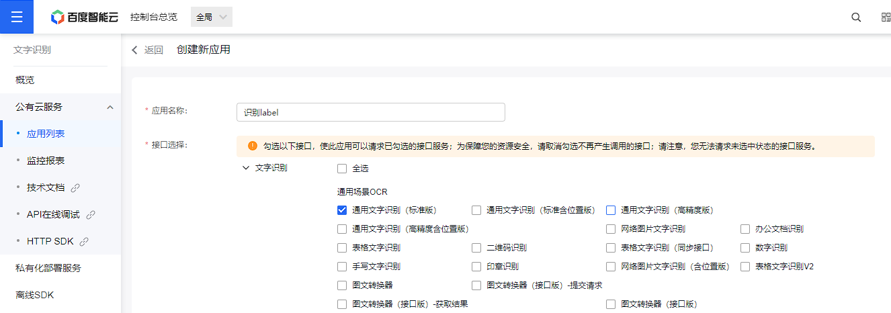

# 模板代码生成工具

快速配置 prop 和 label，生成 el-form 和 el-table 代码

### 省流

快捷键

- f12 可打开$api.后的 api 定义文件
- f12 可查找 vue 模板中的函数定义
- f9 可添加和删除一行 debugger（会覆盖 vscode 的快捷键，可关闭）
- Ctrl + 数字键区 0-7（Mac: Cmd + Alt + 主键盘区 0-7）
  分别打开设置，侧面板表单、表格、api，前端文档、组件库、样式工具类，浏览器

功能

- 在函数上悬停可复制完整函数
- 资源管理器文件夹可执行终端命令
- 在资源管理器文件夹右键可打开最近修改的文件（优先 git 修改过的，不用项目/src/views/demo/index 一级级打开）
- 编辑器选中文本后右键通过搜索引擎、MDN、ElementUI、npmjs 搜索，建议配置为受信任的域
- 编辑器右键打开 Git 仓库和常用文件

- paging-grid 等单页面代码片段，created，computed 等生命周期代码片段
- 设置页面可以打开常用文件、依赖和模板文件夹

问题和 bug

- api 识图暂时不可用，可用第三方软件识别成文字复制后，识别剪切板
- 切换暗黑模式，codemirror 会错位，重新打开可以恢复

## 一、模板生成

侧边栏点击图标，在侧边栏打开模板代码生成工具。

或者右键模板生成 - 表单生成/表格生成/API 生成，在侧边窗口打开模板代码生成工具。
快捷键 <kbd>Ctrl</kbd> + <kbd>数字键区 1/2/3</kbd>
Mac <kbd>Cmd</kbd> + <kbd>Alt</kbd> + <kbd>主键盘区 1/2/3</kbd>

### 通用

#### 表单/表格类型

修改生成 html 数据的模板，可在设置中自定义。

#### 识别剪切板

识别剪切板中的文字或图片，文字以 /s 分割，图片需要注册百度 api 使用（暂不可用）。建议复制文字到记事本调整后识别，无法复制的可以用其他软件识别文字。

#### 使用上次表单/表格数据

点击按钮可以获取另一个页面保存的数据，填入 prop 和 label。用于表格数据填入详情的填写表单，以及剪贴板识别错页面的情况。

#### label 自动判断类型

label 含有“日期，时间，状态，类型，是否，名称，备注，金额，价，数，量”等关键字自动判断类型

#### 复制

- 点击复制按钮复制全部
- 仅复制 form-item/table-column 不会复制开头结尾的 form/table 标签以及筛选重置/操作列
- 代码编辑器内拖动复制选中的内容
- 单击行复制一行

### 表单

#### 识别剪切板

以星号（\*）开头的 label 自动开启必填规则，全局设置开启规则。

### 表格

#### 自定义内容

启用自定义内容后，可以对数据进行处理，比如金额和时间。在可编辑表格状态下，启用可编辑内容，选择嵌入表格的组件类型，包括 el 和 bs 的各种输入框和选择器。组件仅含默认属性，需要自行修改，可以跳转到该组件的参考文档。

### API

- 识别剪切板文字，以 /s 分割
  满足/^(post|get|delete|put)$/i的设置为type
  全是汉字的设置为name
  满足/^(\/[0-9a-zA-Z]+)*$/的设置为 url，前缀为 baseUrl 或 baseUrl2 的设置对应的 baseUrl

- baseUrl、baseUrl2 和 url 必须由 n 个(/[0-9a-zA-Z])组成，如/a/b

- method 由 method 前缀加上 url 的大驼峰组成

- 修改 baseUrl 会自动修改 method 前缀，从而修改每一项的 method
  baseUrl->methodPrefix->method

- 修改一项的 url 会自动修改该项的 method
  url->method

### 设置

快捷键 <kbd>Ctrl</kbd> + <kbd>数字键区 0</kbd>
Mac <kbd>Cmd</kbd> + <kbd>Alt</kbd> + <kbd>主键盘区 0</kbd>

#### 简单模式

开启后表单/表格项数不显示 radio，表单项/列类型以 select 显示，不显示去翻译按钮。

#### 打开文件/文件夹

文件夹会在新窗口打开，用于查看依赖和模板文件夹，不会添加到“最近打开的文件”。

## 二、模板片段

输入前缀后，描述为 vscode-template-generate-tool 的即为插件创建的代码片段。

- html

  - embedded-card
  - template
  - placeholder

- javascript

  - console.log()关键词 <kbd>l</kbd><kbd>l</kbd> 或 console
    - 自带的 log，输入第二次会将 log 作为短语，影响判断
  - async

  | Vue 选项类型 | 关键词                            |
  | ------------ | --------------------------------- |
  | 数据         | data/props/computed/methods/watch |
  | 生命周期钩子 | created/mounted                   |
  | 资源         | components                        |
  | 组合         | mixins                            |

- vue
  - vue
  - style
  - 模板文档 paging-grid/simple-grid/simple-search-grid/edit-grid/form-dialog

## 三、文档

右键文档 - 前端文档/前端组件库/样式工具类，在第一个窗口打开对应文档。
快捷键 <kbd>Ctrl</kbd> + <kbd>数字键区 4/5/6</kbd>
Mac <kbd>Cmd</kbd> + <kbd>Alt</kbd> + <kbd>主键盘区 4/5/6</kbd>

## 四、浏览器

右键文档 - 新建浏览器页签，在第一个窗口打开一个页签，输入网站，网站可以收藏。用于对照接口文档。
快捷键 <kbd>Ctrl</kbd> + <kbd>数字键区 7</kbd>
Mac <kbd>Cmd</kbd> + <kbd>Alt</kbd> + <kbd>主键盘区 7</kbd>

## 五、百度 API 注册

注册后会打电话

### OCR

https://console.bce.baidu.com/ai/#/ai/ocr/overview/index

步骤 1 领取通用文字识别（标准版）。

步骤 2 创建应用，仅需勾选通用文字识别（标准版），归属个人，描述随便填个试用，完成创建。

然后到 https://console.bce.baidu.com/ai/#/ai/ocr/app/list 获取 API Key 和 Secret Key。

### 翻译

http://api.fanyi.baidu.com/doc/21 应该仅需标准版。完成步骤 124 后，到管理控制台-开发者信息获取 APP ID 和密钥。

